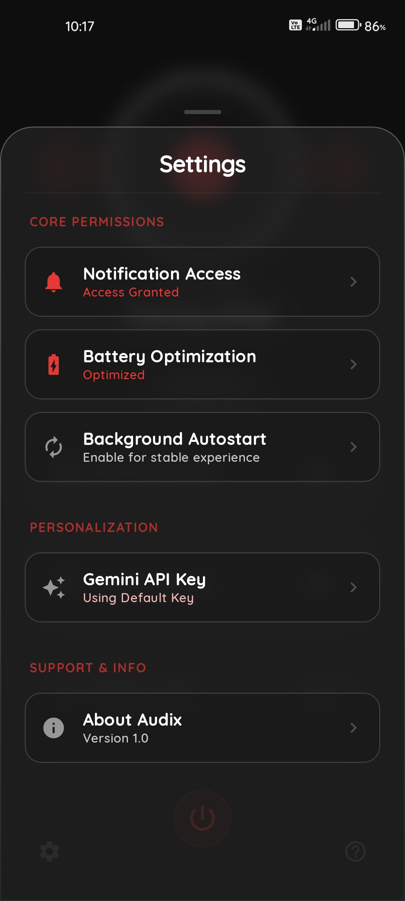
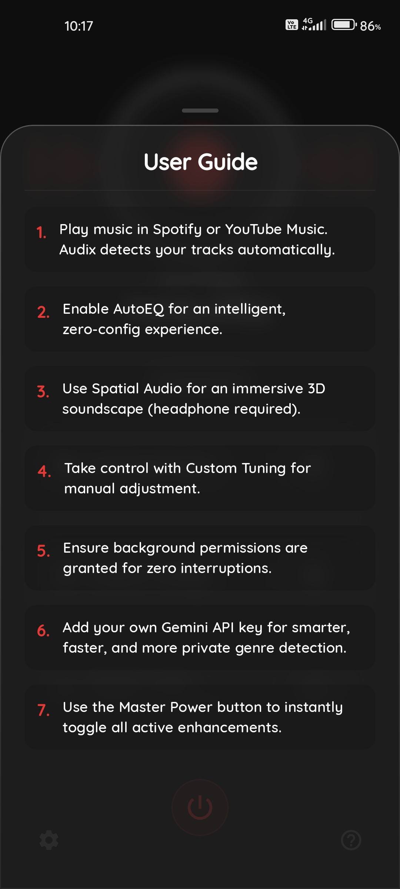
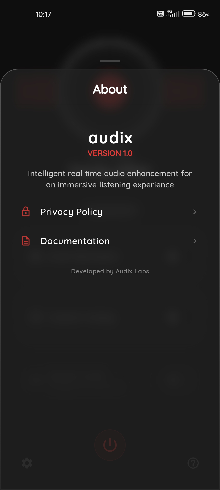

# 🎧 Audix

**Intelligent Audio Engine for Android.**

Audix is a premium, set-and-forget audio enhancement tool that automatically adapts your sound signature based on the music you're listening to. Using AI-powered genre detection, Audix applies professional-grade EQ presets in real-time to deliver the best possible listening experience.

---

## ✨ Key Features

- **🧠 AutoEQ Engine**: Automatically detects the genre of the playing song and applies an optimized EQ preset.
- **🌌 Spatial Audio**: Immersive 3D soundscape with 5 levels of intensity (Headphones required).
- **🎚️ Custom Tuning**: Take control with dedicated Bass, Vocals, and Treble sliders.
- **🔍 Smart Detection**: Works seamlessly with Spotify, YouTube Music, and other major players.
- **⚡ Zero Configuration**: Grant permissions once and let Audix do the work in the background.
- **🔒 Privacy First**: No accounts, no data leaves your device (except for encrypted metadata for AI classification).

---

## 📸 Visual Experience

  
  
  

  <i>Main Interface • Spatial Audio • Custom Tuning</i>

| Features | Detail Views |
| :---: | :---: |
|  |  |
| *Immersive Audio* | *AI Genre Control* |

| Configuration | Information | Status States |
| :---: | :---: | :---: |
|  |  |  |
|  |  |  |
| *App Settings* | *Help & Support* | *Engine States* |

---

## 🚀 Getting Started

1. **Install & Permissions**: Audix requires **Notification Access** to identify songs and **Battery Optimization Exemption** to run reliably in the background.
2. **Play Music**: Open your favorite music app (Spotify/YT Music) and play any track.
3. **Enjoy**: Audix will detect the track and apply the best EQ signature automatically.

---

## 🛠️ Technology Stack

- **Engine**: Android `AudioEffect` & `Equalizer` APIs.
- **AI**: Gemini API for real-time genre classification.
- **Modern UI**: Built with Jetpack Compose following premium design principles.
- **Reliability**: Foreground services ensure persistent audio processing.

---

## 📜 Documentation

- [User Guide](USER_GUIDE.md) - Detailed feature walkthrough and troubleshooting.
- [Privacy Policy](PRIVACY_POLICY.md) - Our commitment to your data security.
- [License](LICENSE) - GNU Affero General Public License v3.0 (AGPL-3.0).

---

## 🤝 Contributing

Contributions are welcome! Please feel free to submit a Pull Request.

---

*Audix — Elevating your sound, intelligently.*
